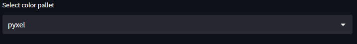
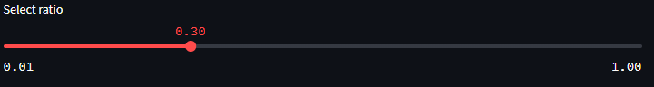
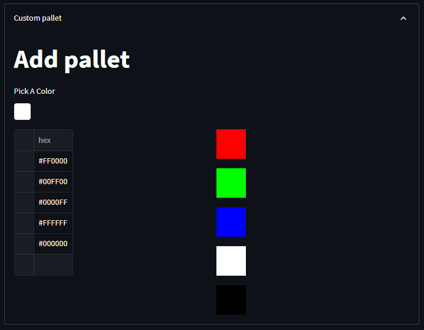

# share-page
Language : [English](README.md)  
[share-page](https://share-page.streamlit.app)

# Some functions

# colorpallet
This site converts colors.  
Select the color palette to use when converting colors.  

# ratio
This is a slider that can be adjusted in increments of 0.01. The lower the number, the larger the dot.

# Custom Pallet
You can create your own ColorPallet.  

# Experimental Features
This is not an official feature yet, so there may be bugs or errors.  

# Join

