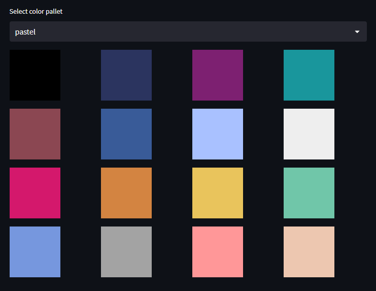

# pixelart-converter
Language : [English](README.md)  
Fascinating tool to convert images into pixel art!  
[pixelart-converter](https://share-page.streamlit.app)

# Basic functions
## colorpallet
This site converts colors.  
Select the color palette to use when converting colors.  
Pyxel is the color used in the library called [Pyxel](https://github.com/kitao/pyxel).  

## ratio
This is a slider that can be adjusted in increments of 0.01. The lower the number, the larger the dot.

## Custom Pallet
You can create your own ColorPallet.  
Enter the colors you want to add to the palette in the table using color codes.  
The colors entered in the table will be displayed on the right side.  
It is easier to select a color from the color picker above the table, copy the color code, and enter it.  
Color picker is not supported.

# Experimental Features
This is not an official feature yet, so there may be bugs or errors.  
## Pixel Edge
Generate edges with dots.

# Color Sample
Displays the colors in the default color palette  

